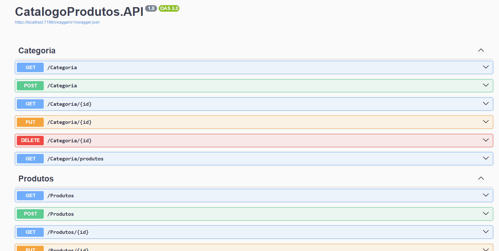
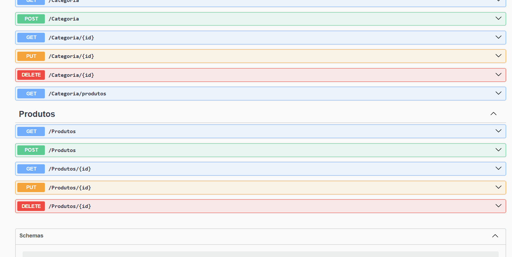

# API de Catálogo de Produtos (.NET 8)

[](https://dotnet.microsoft.com/pt-br/download/dotnet/8.0)
[](https://blog.cleancoder.com/uncle-bob/2012/08/13/the-clean-architecture.html)
[](https://redis.io/)
[]()

Uma API REST robusta para gerenciamento de catálogo e inventário (Produtos e Categorias), construída com .NET 8, Clean Architecture e foco em performance e boas práticas.

## 🚀 Demonstração em Ação

### Gerenciamento de Categorias (CRUD)
*(Fluxo: `GET` (vazio) -> `POST` (criação) -> `GET` (com dados))*



### Gerenciamento de Produtos (CRUD)
*(Fluxo: `GET` (vazio) -> `POST` (criação) -> `GET` (com dados))*



---

## ✨ Principais Features e Conceitos Aplicados

Este projeto não é apenas um CRUD, mas um *playground* para demonstrar conceitos avançados de arquitetura e performance:

* **Clean Architecture:** O projeto é segregado em 4 camadas (Core, Application, Infrastructure, API) seguindo a **Regra da Dependência**, garantindo baixo acoplamento e alta testabilidade.
* **Princípios SOLID:**
    * **S (Single Responsibility):** Cada Service, Repository e Controller tem uma única responsabilidade.
    * **O (Open/Closed):** O uso de Injeção de Dependência e Interfaces (`IRepository`, `ICacheService`) permite estender o comportamento (ex: adicionar um novo banco ou cache) sem modificar o código existente.
    * **L (Liskov Substitution):** O uso do `Repository<T>` genérico é um exemplo claro.
    * **I (Interface Segregation):** Interfaces específicas como `IProdutoRepository` segregam contratos que o `IRepository<T>` genérico não cobre.
    * **D (Dependency Inversion):** A camada `Application` depende de abstrações (`Interfaces` do Core) e não de implementações (`Infrastructure`).
* **Cache Híbrido (L1/L2):**
    * **L1 (In-Memory):** Cache em memória (`IMemoryCache`) para acesso ultra-rápido a dados frequentemente consultados.
    * **L2 (Distributed):** Cache distribuído com **Redis** (`IDistributedCache`) para garantir consistência entre múltiplas instâncias da aplicação.
    * **Invalidação Ativa:** O cache é invalidado (removido) automaticamente em operações de escrita (Create, Update, Delete) para evitar dados obsoletos.
* **Repository Pattern Genérico:** Abstrai o acesso a dados, permitindo a troca da fonte de dados (ex: de EF Core para Dapper) sem impactar a lógica de negócio.
* **Middleware de Tratamento Global de Erros:** Um middleware centralizado captura todas as exceções não tratadas, formatando uma resposta de erro (`ProblemDetails`) padronizada para a API.
* **Validação (FluentValidation):** Validação declarativa e robusta dos DTOs de entrada, mantendo os controllers limpos.
* **Injeção de Dependência (DI):** Totalmente configurada nativamente pelo .NET para desacoplar todos os componentes.
* **Programação Assíncrona (Async/Await):** Uso extensivo de `async/await` desde os controllers até o banco de dados para garantir performance e escalabilidade.

---

## 📂 Estrutura da Solução (Clean Architecture)

A estrutura do projeto reflete a separação de responsabilidades:

```
├── 📁 Catalogo.Core (Domain)
│   ├── 📁 Entities (Ex: Produto, Categoria)
│   └── 📁 Interfaces (Ex: IRepository<T>, IProdutoRepository)
│
├── 📁 Catalogo.Application (Application)
│   ├── 📁 DTOs (Ex: ProdutoResponseDTO, CategoriaCreateDTO)
│   ├── 📁 Interfaces (Ex: IProdutoService, ICacheService)
│   ├── 📁 Mappings (AutoMapper)
│   ├── 📁 Services (Lógica de negócio)
│   └── 📁 Validators (FluentValidation)
│
├── 📁 Catalogo.Infrastructure (Infrastructure)
│   ├── 📁 Data (DbContext, Migrations)
│   └── 📁 Repositories (Implementações das Interfaces do Core)
│
├── 📁 CatalogoProdutos.API (Presentation)
│   ├── 📁 Controllers (Endpoints da API)
│   └── 📁 Middleware (Ex: GlobalExceptionMiddleware)
│
└── 📄 CatalogoSolucao.sln
```

---

## 💻 Tecnologias Utilizadas

* **.NET 8**
* **ASP.NET Core 8** (para a API REST)
* **Entity Framework Core 8** (ORM para persistência de dados)
* **SQLite** (Banco de dados local)
* **Redis** (Cache Distribuído)
* **AutoMapper** (Mapeamento de DTOs)
* **FluentValidation** (Validação de DTOs)
* **Swagger/OpenAPI** (Documentação da API)

---

## 🚀 Como Executar o Projeto

### Pré-requisitos

* [.NET 8 SDK](https://dotnet.microsoft.com/pt-br/download/dotnet/8.0)
* Um servidor [Redis](https://redis.io/docs/getting-started/installation/) (ou [Redis rodando via Docker](https://hub.docker.com/_/redis))

### 1. Clone o Repositório

```bash
git clone [https://github.com/juniorjuarez/CatalogoProdutosApi.git](https://github.com/juniorjuarez/CatalogoProdutosApi.git)
cd CatalogoProdutosApi
```

### 2. Configure as Conexões

Abra o arquivo `CatalogoProdutos.API/appsettings.Development.json` e configure as connection strings do seu banco de dados e do Redis:

```json
"ConnectionStrings": {
  "DefaultConnection": "Data Source=catalogo.db", // (Já configurado para SQLite)
  "Redis": "localhost:6379" // (Confirme se seu Redis está nesta porta)
}
```

### 3. Restaure Dependências e Rode as Migrations

```bash
# Restaura os pacotes NuGet
dotnet restore

# Navega para o projeto de API (onde o appsettings está)
cd CatalogoProdutos.API

# Aplica as migrations (cria o banco de dados)
# (O --project aponta para onde o DbContext está)
dotnet ef database update --project ../Catalogo.Infrastructure
```

### 4. Execute a Aplicação

```bash
# Ainda dentro da pasta CatalogoProdutos.API
dotnet run
```

Acesse a documentação do Swagger e teste os endpoints em: `http://localhost:5000/swagger` (ou a porta indicada no terminal).

---

## 🗺️ Endpoints da API (Swagger)

A documentação completa pode ser acessada via Swagger (`/swagger`) quando a aplicação está em execução.

#### Endpoints de Categoria

| Verbo | Rota | Descrição |
| :--- | :--- | :--- |
| `GET` | `/api/v1/Categoria` | Lista todas as categorias. |
| `GET` | `/api/v1/Categoria/{id}` | Busca uma categoria por ID. |
| `GET` | `/api/v1/Categoria/produtos` | Lista todas as categorias com seus produtos. |
| `POST` | `/api/v1/Categoria` | Cria uma nova categoria. |
| `PUT` | `/api/v1/Categoria/{id}` | Atualiza uma categoria existente. |
| `DELETE` | `/api/v1/Categoria/{id}` | Deleta uma categoria. |

#### Endpoints de Produto

| Verbo | Rota | Descrição |
| :--- | :--- | :--- |
| `GET` | `/api/v1/Produtos` | Lista todos os produtos. |
| `GET` | `/api/v1/Produtos/{id}` | Busca um produto por ID. |
| `POST` | `/api/v1/Produtos` | Cria um novo produto. |
| `PUT` | `/api/v1/Produtos/{id}` | Atualiza um produto existente. |
| `DELETE` | `/api/v1/Produtos/{id}` | Deleta um produto. |

---

## 🛣️ Roadmap (Próximos Passos)

* [ ] Implementar **Autenticação e Autorização** (JWT).
* [ ] Implementar **Paginação** nos endpoints de listagem (`GET`).
* [ ] Adicionar **Testes Unitários** (xUnit/NUnit).
* [ ] Implementar o pattern **Unit of Work** para transações atômicas.
